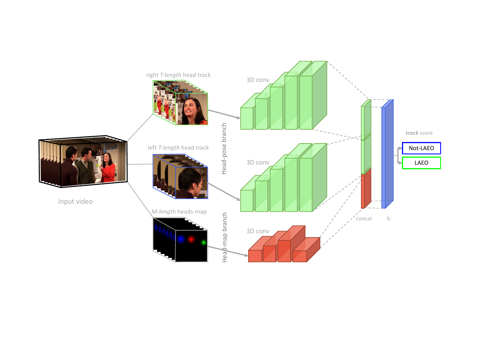

# LAEO-Net++
  

[](https://colab.research.google.com/drive/11abr3TV6Nb3pbjVTzE_tUOvMKRdE2NRm?usp=sharing)


Official support code for [LAEO-Net++ paper](https://arxiv.org/abs/2101.02136) (IEEE TPAMI, 2021).

<div align="center">
    
</div>
The LAEO-Net++ receives as input two tracks of head crops and a tracks of maps containing the relative position of the heads, and 
returns the probability of being LAEO those two heads.


See previous version [here](https://github.com/AVAuco/laeonet)

### Quick start

The following demo predicts the LAEO label on a pair of heads included in 
subdirectory `data/ava_val_crop`. You can choose either to use a model trained on UCO-LAEO 
or a model trained on AVA-LAEO.   

```bash
cd laeonetplus
python mains/ln_demo_test.py
```

*Training code will be available soon.*

### Detecting and tracking heads

See older [GitHub repository](https://github.com/AVAuco/laeonet).

### Install

Clone this repository:
```bash
git clone git@github.com:AVAuco/laeonet.git
```

### Training (_in progress_)

We provide an example of training on AVA-LAEO data (using preprocessed samples):
1. Download AVA-LAEO preprocessed samples: 
   [train](https://ucordoba-my.sharepoint.com/:u:/g/personal/in1majim_uco_es/EVkU-xdW2aBFttdOS7mh_P0B4hocxDIu2emydcjIzgXi7Q?e=qgLfg7), 
   [val](https://ucordoba-my.sharepoint.com/:u:/g/personal/in1majim_uco_es/ETVdi2M2H2hNrMPres9saQgB-NLCQjVdMGcsRaZz_fBJfw?e=YE4J5D)
2. Training code assumes that the previous tar files are not unpacked. 
   So, just place them in a couple of directories and update the code to point to those directories.
3. From the root directory of the proyect, run the following command:
`python train/ln_train3DconvModelGeomMBranchCropMapAVA.py -g 0.43 -e 60 -l 0.0001 
-d 0.2 -n 1 -s 32 -a 1 -z 0 -b 8 -f 1 -F 0 -k 0.3 -c 0 -R 2 -L 1 -m 0 -u 0 
--useframecrop=0 --usegeometry=0 --initfilefm="" --usemap=1 --mapwindowlen=10 -S 1 
--DEBUG=0 --trainuco=0 --testuco=1 --infix=_ss64jitter 
-w ./model-init-ssheadbranch.hdf5 --useself64=1`

### References
Marin-Jimenez, M. J., Kalogeiton, V., Medina-Suarez, P., Zisserman, A. (2021). [LAEO-Net++: revisiting people Looking At Each Other in videos.](https://www.researchgate.net/profile/Manuel_Marin-Jimenez/publication/347975905_LAEO-Net_revisiting_people_Looking_At_Each_Other_in_videos/links/5feb137592851c13fed05037/LAEO-Net-revisiting-people-Looking-At-Each-Other-in-videos.pdf) IEEE transactions on Pattern Analysis and Machine Intelligence, PP, 10.1109/TPAMI.2020.3048482. Advance online publication. https://doi.org/10.1109/TPAMI.2020.3048482

```
@article{marin21pami,
  author    = {Mar\'in-Jim\'enez, Manuel J. and Kalogeiton, Vicky and Medina-Su\'arez, Pablo and and Zisserman, Andrew},
  title     = {{LAEO-Net++}: revisiting people {Looking At Each Other} in videos},
  journal   = {IEEE Transactions on Pattern Analysis and Machine Intelligence},
  doi       = {10.1109/TPAMI.2020.3048482},
  year      = {2021}
}
```

Conference version:
```
@inproceedings{marin19cvpr,
  author    = {Mar\'in-Jim\'enez, Manuel J. and Kalogeiton, Vicky and Medina-Su\'arez, Pablo and and Zisserman, Andrew},
  title     = {{LAEO-Net}: revisiting people {Looking At Each Other} in videos},
  booktitle = CVPR,
  year      = {2019}
}
```